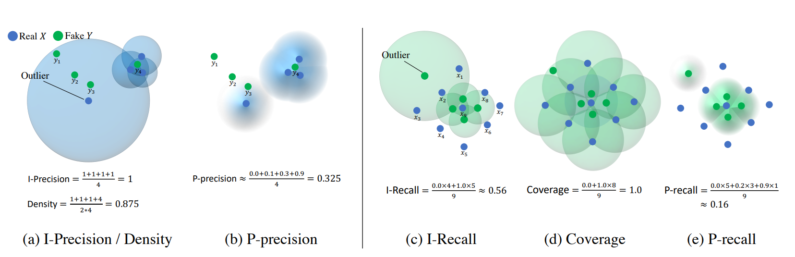

# Probabilistic Precision and Recall Towards Reliable Evaluation of Generative Models (ICCV 2023)
The official implementation of **Probabilistic Precision and Recall Towards Reliable Evaluation of Generative Models** (P-precision & P-recall), accepted at ICCV-2023.
P-precision and P-recall aims to provide reliable estimates for evaluating fidelity and diversity of generative models even with the presence of out-of-distribution samples, based on our novel probabilistic approach.
The paper will be cited shortly.


Our motivation arises from the recognition that accurately estimating the ground truth support is infeasible with empirical observations alone. As a result, it becomes difficult to determine whether a sample belongs to the ground truth support with certainty (0 or 1) like IP&IR and D&C. Therefore, we adopt a probabilistic perspective and define the probability of a sample belonging to the support, taking into account the uncertainty surrounding the ground truth support. Then, our metric is capable of assigning different scores to different samples (as illustrated in the above figure) based on the likelihood of belonging to the support, effectively addressing outlier concerns.

## Requirements
```
pip install -r requirements.txt
```

## Usage for toy experiments

### 0. Example
Below is the script for measuring p-precision (fidelity) and p-recall (diversity) between two Gaussian distributions.
```python
import numpy as np
from metric.pp_pr import compute_pprecision_precall

num_real = 5000
num_fake = 5000
dims = 64

real_sample = np.random.randn(num_real, dims)
fake_sample = np.random.randn(num_fake, dims)

p_precision, p_recall = compute_pprecision_precall(real_sample, fake_sample)
```

### 1. Outlier Test
The following command will reproduce the results of Figure 2a and 2b in our paper.  
```
python toy_experiment.py --dim 64 --datanum 10000 --setting outlier_f
```

### 2. Reflecting fidelity and diversity
The following command will reproduce the results of Figure 5 in our paper.
```
python toy_experiment.py --dim 64 --datanum 10000 --setting trade_off
```

## Usage for evaluating generative model
To be updated soon.

### 1. Preparing real and generated samples.

### 2. Precomputing the feature embeddings of real and generated samples.

### 3. Evaluation
